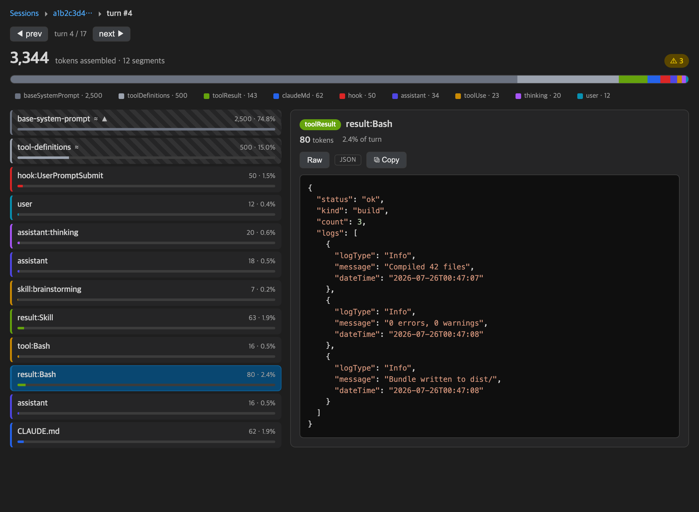
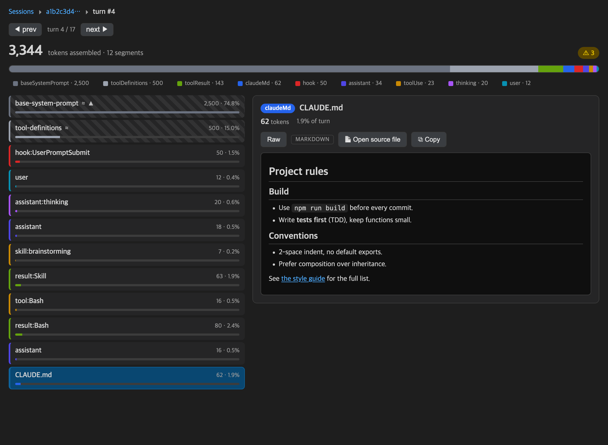
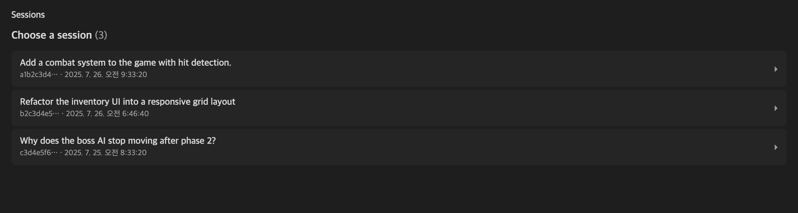

# Claude Context Visualizer

**English** | [한국어](#한국어)

A VS Code extension that visualizes **how Claude Code assembles its per-turn LLM
context** — CLAUDE.md, skills, hooks, memory, MCP instructions, tool calls/results,
and history — with local token estimates, so you can debug and optimize what
actually goes into the model.

- **Session → Turn → Context** drill-down, entirely in a panel
- Token-weighted segment list + composition bar; click a segment to see its **raw data**
- **Auto-formatted raw view**: JSON pretty-printed & highlighted, code syntax-highlighted, Markdown rendered
- First-class **tool_use / tool_result / skill** segments (see exactly what tools and skills pulled in)
- **Subagent drill-down**: expand an `Agent` call to read that agent's own transcript, kept out of this turn's totals because it ran in its own context window
- Click-to-toggle **type filters**; optimization **waste flags** (repeated / large / estimated)
- Portable: matches sessions to the open workspace by the `cwd` recorded in each transcript — one install works in every project

Nothing leaves your machine: it reads local Claude Code transcripts
(`~/.claude/projects/…`) and your workspace config. No network, no API key.

## Screenshots

Every turn broken into token-weighted segments — click one to see the exact raw
data it contributed. Tool results are auto-formatted (here, pretty-printed JSON):



CLAUDE.md, skill bodies, and hook injections render as Markdown; toggle to raw anytime:



Pick a session by its first prompt, then drill into a turn:



> Screenshots use synthetic sample data.

## The controls

Every toggle answers a different question. None of them changes the data — only
which reading of it you get.

### 🧵 Full context ⇄ ◻ This turn only

**What Claude received on this turn, versus what this turn itself added.**

*Full context* rebuilds the entire message thread the model was handed: every prior
turn carried as history, compaction summaries, and the messages compaction replayed
verbatim. It is the whole prompt, which is what you want when asking "why is this
turn so expensive?"

*This turn only* drops the history and shows the turn's own records. Faster, and
the right view when you want to see what one exchange contributed on its own.
Measured `usage` is only shown in full-context mode — a total covering the whole
thread would not describe a single turn's records.

### ▭ window scale ⇄ ▬ composition scale

**How full the context window is, versus what the context is made of.**

*Window scale* (the default) draws the bar across the answering model's full
context window, so a turn filling 4% of it looks nothing like one filling 60%. The
empty track on the right is headroom.

*Composition scale* normalizes the bar to this turn's own size, so the categories
fill the width. Small categories become readable again — the trade is that every
turn's bar then looks equally full.

The toggle only appears when the model's window is known. For an unrecognized model
the panel scales by what it measured rather than inventing a ceiling.

### Type filter chips · ↺ show all · ⊘ hide all

**Click any category chip to hide it.** The rows leave the list, the bar dims that
slice, and a `≈ N shown` figure appears in the header — the fastest way to answer
"what would this turn cost without the hooks?" `⊘ hide all` clears everything so you
can add back only the one or two categories you care about. Filters persist as you
move between turns.

The measured total does **not** move when you filter. It is a measurement of what the
model was actually sent; hiding a category cannot change that. Only the `shown`
subtotal responds.

### ⟳ Refresh

Re-reads the transcript and your workspace config from disk. Everything is cached
for the panel's lifetime, so a session Claude Code is still writing to would
otherwise stay frozen at whatever it looked like when you opened the panel. Parked
on the newest turn, you stay pinned to the newest turn as the transcript grows.

### ✨ Auto view ⇄ `</>` Raw

*Auto view* formats a segment by what it is: JSON pretty-printed and highlighted,
code syntax-highlighted, Markdown rendered. *Raw* shows the exact bytes the segment
contributed — use it when the formatting is hiding whitespace, escaping, or an
envelope you need to see.

### ▸ Agent call rows

An `Agent` call expands into that subagent's own transcript, read from its separate
file on demand. Its segments are indented and **excluded from this turn's totals**:
the subagent ran in its own context window, so folding its tokens into this one
would be double-counting.

## How segments are categorized

Two categories are easy to misread, so they are worth stating plainly:

- **`user` means a human typed it.** Claude Code also writes skill bodies,
  slash-command expansions, task notifications, and reminders into the user turn.
  Those are sorted out by what they are (`skill`, `systemReminder`, …) and anything
  left that the transcript flags as not-a-real-user-message lands in
  **`auto-inserted`**, never in `user`.
- **`not-in-transcript`** is the base system prompt and the tool JSON schemas —
  sent on every request, written to none of them. It is hatched because there is no
  text to show: those bytes exist only in the HTTP request. When a turn records no
  `usage`, it falls back to a size measured from a reference capture and says so.
- **`estimate gap`** is *not* missing content. It is the weight of rows already on
  screen that the per-segment estimator sized too small — the difference between the
  measurement and the sum of the estimates above it.

  The two are split by fitting `measured ≈ slope × recorded + intercept` across the
  session's own turns, which holds at R² > 0.99 on most sessions. The intercept is
  what rides along regardless of conversation length (`not-in-transcript`); the rest
  grows with the content (`estimate gap`). Keeping them apart matters because the
  gap is usually the larger of the two — on one session it was 69% of the combined
  figure, so reading the whole thing as "content the transcript never held" would be
  wrong about most of it.

  A session gets the split only when the fit stands up: at least 5 turns, R² ≥ 0.9,
  and a slope above 1. Otherwise the panel keeps them as one combined row rather
  than asserting a division the data does not support. The fit is sampled across
  8 turns and cached per session.

This is also why the `not-in-transcript` share jumps after a compaction. Compaction
summarizes the conversation; it does not shrink the system prompt or the tool
schemas. The numerator stays put while the denominator collapses, so the share
rises — that is the arithmetic working, not a glitch.

## Install

> After installing, run **Developer: Reload Window**, open any project you've used
> with Claude Code, then Command Palette → **Claude Context: Visualize**.

### Option A — download the `.vsix` from Releases (recommended)

1. Open the [**Releases**](https://github.com/Leehongseok-code/claude-context-visualizer/releases) page and download the latest `claude-context-visualizer-*.vsix`.
2. Install it, either:
   - **CLI:** `code --install-extension claude-context-visualizer-*.vsix`
   - **UI:** Extensions panel → `⋯` menu → **Install from VSIX…**

### Option B — one line (needs the [GitHub CLI](https://cli.github.com))

```bash
gh release download -R Leehongseok-code/claude-context-visualizer --pattern '*.vsix' --clobber \
  && code --install-extension claude-context-visualizer-*.vsix
```

### Option C — build from source

```bash
git clone https://github.com/Leehongseok-code/claude-context-visualizer
cd claude-context-visualizer
npm install && npm run build && npm run package
code --install-extension claude-context-visualizer-*.vsix
```

> No `code` command? In VS Code run Command Palette → **Shell Command: Install 'code' command in PATH**, or just use the UI install (Option A, second bullet).

## Develop

- `npm install` · `npm run build` · `npm test` · `npm run typecheck`
- Press **F5** for the Extension Development Host.
- `npm run package` produces the `.vsix`.

## Releasing

Pushing a `v*` tag builds, tests, packages, and attaches the `.vsix` to a GitHub
Release automatically (see `.github/workflows/release.yml`):

```bash
# bump "version" in package.json, then:
git tag v0.1.1 && git push origin v0.1.1
```

## License

MIT — see [LICENSE](LICENSE).

---

# 한국어

[English](#claude-context-visualizer) | **한국어**

**Claude Code가 매 턴 LLM 컨텍스트를 어떻게 조립하는지** 눈으로 확인하는 VS Code
확장입니다. CLAUDE.md, 스킬, 훅, 메모리, MCP 지시문, 도구 호출/결과, 대화 히스토리를
토큰 추정치와 함께 분해해서 보여주므로, **실제로 모델에 무엇이 들어가는지** 디버깅하고
최적화할 수 있습니다.

- **세션 → 턴 → 컨텍스트** 드릴다운을 패널 하나에서
- 토큰 비중 순 세그먼트 목록 + 구성 막대. 세그먼트를 클릭하면 **원본 데이터**를 그대로 확인
- **원본 자동 포매팅**: JSON은 정렬·하이라이트, 코드는 문법 강조, 마크다운은 렌더링
- **tool_use / tool_result / 스킬**을 1급 세그먼트로 취급 — 어떤 도구와 스킬이 무엇을 끌어왔는지 정확히 표시
- **서브에이전트 드릴다운**: `Agent` 호출을 펼치면 그 에이전트의 트랜스크립트를 그대로 열람. 별도 컨텍스트 윈도우에서 실행됐으므로 현재 턴의 토큰 합계에는 포함되지 않습니다
- 클릭 토글 **타입 필터**와 최적화용 **낭비 플래그**(중복 / 과대 / 추정치)
- 프로젝트 이식성: 각 트랜스크립트에 기록된 `cwd`로 열려 있는 워크스페이스와 세션을 매칭하므로, 한 번 설치하면 모든 프로젝트에서 동작합니다

**아무것도 외부로 나가지 않습니다.** 로컬 Claude Code 트랜스크립트(`~/.claude/projects/…`)와
워크스페이스 설정만 읽습니다. 네트워크 통신도, API 키도 필요 없습니다.

## 스크린샷

턴 전체가 토큰 비중별 세그먼트로 쪼개집니다. 하나를 클릭하면 그 세그먼트가 기여한 원본
데이터를 볼 수 있고, 도구 결과는 자동 포매팅됩니다(아래는 JSON 정렬 예시):


CLAUDE.md, 스킬 본문, 훅 주입 내용은 마크다운으로 렌더링되며 언제든 원본 보기로 전환할 수 있습니다:


첫 프롬프트를 보고 세션을 고른 뒤, 원하는 턴으로 들어갑니다:


> 스크린샷은 예시용 합성 데이터입니다.

## 화면의 토글들

토글마다 답하는 질문이 다릅니다. 데이터를 바꾸는 건 하나도 없고, **어떤 방식으로 읽을지**만 바뀝니다.

### 🧵 Full context ⇄ ◻ This turn only

**이번 턴에 Claude가 받은 전부 vs 이번 턴이 새로 더한 것.**

*Full context*는 모델에게 실제로 전달된 메시지 스레드 전체를 재구성합니다 — 히스토리로 딸려간 이전 턴들, 압축 요약, 그리고 압축이 그대로 다시 보낸 보존 메시지까지. **"이 턴은 왜 이렇게 비싼가"**를 볼 때 필요한 화면입니다.

*This turn only*는 히스토리를 빼고 이 턴의 레코드만 봅니다. 더 빠르고, **한 번의 주고받음이 얼마를 더했는지** 볼 때 적합합니다. 실측 `usage`는 Full context에서만 표시됩니다 — 스레드 전체를 잰 총량으로 한 턴의 레코드를 설명할 수는 없으니까요.

### ▭ window scale ⇄ ▬ composition scale

**컨텍스트 윈도우가 얼마나 찼나 vs 그 안이 무엇으로 채워졌나.**

*Window scale*(기본값)은 막대를 **응답한 모델의 컨텍스트 윈도우 전체**에 걸쳐 그립니다. 4%를 쓴 턴과 60%를 쓴 턴이 확연히 다르게 보이고, 오른쪽 빈 트랙이 남은 여유입니다.

*Composition scale*은 막대를 이 턴 크기로 정규화해서 카테고리가 폭을 꽉 채웁니다. 작은 카테고리가 다시 읽히는 대신, 모든 턴의 막대가 똑같이 꽉 차 보입니다.

이 토글은 **모델의 윈도우를 아는 경우에만** 나타납니다. 모르는 모델이면 천장을 지어내지 않고 측정값 기준으로 그립니다.

### 타입 필터 칩 · ↺ show all · ⊘ hide all

**카테고리 칩을 클릭하면** 목록에서 행이 빠지고, 막대의 해당 구간이 흐려지고, 헤더에 `≈ N shown` 이 나타납니다. *"훅이 없었으면 이 턴은 얼마였을까"*를 가장 빨리 확인하는 방법입니다. `⊘ hide all`로 전부 끈 뒤 보고 싶은 한두 개만 켜는 방식도 됩니다. 필터는 턴을 넘겨도 유지됩니다.

**실측 총량은 필터로 바뀌지 않습니다.** 모델에게 실제로 전달된 것을 잰 값이라, 카테고리를 숨긴다고 달라질 수 없습니다. `shown` 소계만 반응합니다.

### ⟳ Refresh

트랜스크립트와 워크스페이스 설정을 디스크에서 다시 읽습니다. 패널이 열려 있는 동안 모든 걸 캐시하기 때문에, **Claude Code가 지금도 쓰고 있는 세션**은 이걸 누르지 않으면 패널을 열었던 시점에 멈춰 있습니다. 최신 턴에 있었다면 트랜스크립트가 늘어나도 계속 최신 턴에 붙어 있습니다.

### ✨ Auto view ⇄ `</>` Raw

*Auto view*는 세그먼트를 정체에 맞게 포매팅합니다 — JSON은 정렬·하이라이트, 코드는 문법 강조, 마크다운은 렌더링. *Raw*는 그 세그먼트가 기여한 **바이트 그대로**를 보여줍니다. 포매팅이 공백·이스케이프·감싸는 태그를 가리고 있을 때 쓰세요.

### ▸ Agent 호출 행

`Agent` 호출을 펼치면 그 서브에이전트의 트랜스크립트가 별도 파일에서 그 자리에 읽혀 들어옵니다. 들여쓰기되어 표시되며 **이 턴의 합계에는 포함되지 않습니다** — 서브에이전트는 자기만의 컨텍스트 윈도우에서 돌았으므로, 토큰을 여기 더하면 이중 계산이 됩니다.

## 세그먼트 분류에 대해

오해하기 쉬운 두 가지만 짚어둡니다:

- **`user`는 사람이 직접 친 것만입니다.** Claude Code는 스킬 본문, 슬래시 커맨드 확장, 태스크 알림, 리마인더도 user 턴에 써 넣습니다. 그런 것들은 정체에 따라(`skill`, `systemReminder` …) 분류되고, 남은 것 중 트랜스크립트가 "진짜 사용자 메시지가 아니다"라고 표시한 건 전부 **`auto-inserted`**로 갑니다. `user`로는 절대 안 들어갑니다.
- **`not-in-transcript`**는 매 요청 전송되지만 로그에는 한 번도 안 남는 **base 시스템 프롬프트와 도구 JSON 스키마**입니다. 빗금으로 표시되는 이유는 **보여줄 텍스트가 없기 때문**입니다 — 그 바이트는 HTTP 요청 안에만 존재합니다. 턴에 `usage`가 없으면 기준 캡처에서 잰 크기로 대체하고, 그 사실을 노트에 적습니다.
- **`estimate gap`**은 **없는 내용이 아닙니다.** 화면에 이미 떠 있는 행들이 실제로는 더 큰데 추정기가 작게 잰 분량 — 실측값과 위쪽 추정치 합계의 차이입니다.

  두 값은 세션 자신의 턴들에 `measured ≈ slope × recorded + intercept`를 적합시켜 나눕니다. 대부분 세션에서 R²가 0.99를 넘습니다. **절편**은 대화가 길어져도 그대로인 부분(`not-in-transcript`), **나머지**는 내용과 함께 커지는 부분(`estimate gap`)입니다.

  굳이 나누는 이유는 **보통 gap이 더 크기 때문**입니다. 어떤 세션에선 합계의 **69%** 가 gap이었습니다. 전체를 "로그에 없는 것"으로 읽으면 대부분을 틀리게 이해합니다.

  적합이 신뢰할 만할 때만 나눕니다 — **5턴 이상, R² ≥ 0.9, slope > 1**. 아니면 데이터가 뒷받침하지 않는 구분을 주장하는 대신 예전처럼 한 행으로 둡니다. 적합은 8개 턴을 샘플링해 세션당 한 번 계산하고 캐시합니다.

압축 직후 `not-in-transcript` **비중이 치솟는 것도 같은 이유**입니다. 압축은 대화를 요약하지 시스템 프롬프트와 도구 스키마를 줄이지 않습니다. 분자는 그대로인데 분모만 무너지니 비중이 오르는 것 — 고장이 아니라 산수가 제대로 작동하는 겁니다.

## 설치

> 설치 후 **Developer: Reload Window**를 실행하고, Claude Code로 작업한 적 있는 프로젝트를
> 연 다음 명령 팔레트에서 **Claude Context: Visualize**를 실행하세요.

### 방법 A — Releases에서 `.vsix` 내려받기 (권장)

1. [**Releases**](https://github.com/Leehongseok-code/claude-context-visualizer/releases) 페이지에서 최신 `claude-context-visualizer-*.vsix`를 받습니다.
2. 둘 중 편한 방식으로 설치합니다:
   - **CLI:** `code --install-extension claude-context-visualizer-*.vsix`
   - **UI:** 확장 패널 → `⋯` 메뉴 → **Install from VSIX…**

### 방법 B — 한 줄로 ([GitHub CLI](https://cli.github.com) 필요)

```bash
gh release download -R Leehongseok-code/claude-context-visualizer --pattern '*.vsix' --clobber \
  && code --install-extension claude-context-visualizer-*.vsix
```

### 방법 C — 소스에서 직접 빌드

```bash
git clone https://github.com/Leehongseok-code/claude-context-visualizer
cd claude-context-visualizer
npm install && npm run build && npm run package
code --install-extension claude-context-visualizer-*.vsix
```

> `code` 명령이 없나요? VS Code에서 명령 팔레트 → **Shell Command: Install 'code' command in PATH**를 실행하거나, 그냥 UI로 설치하세요(방법 A의 두 번째 항목).

## 개발

- `npm install` · `npm run build` · `npm test` · `npm run typecheck`
- **F5**를 누르면 Extension Development Host가 뜹니다.
- `npm run package`로 `.vsix`를 만듭니다.

## 릴리스

`v*` 태그를 푸시하면 빌드·테스트·패키징 후 `.vsix`가 GitHub Release에 자동으로
첨부됩니다(`.github/workflows/release.yml` 참고):

```bash
# package.json의 "version"을 올린 뒤:
git tag v0.1.1 && git push origin v0.1.1
```

## 라이선스

MIT — [LICENSE](LICENSE) 참고.
